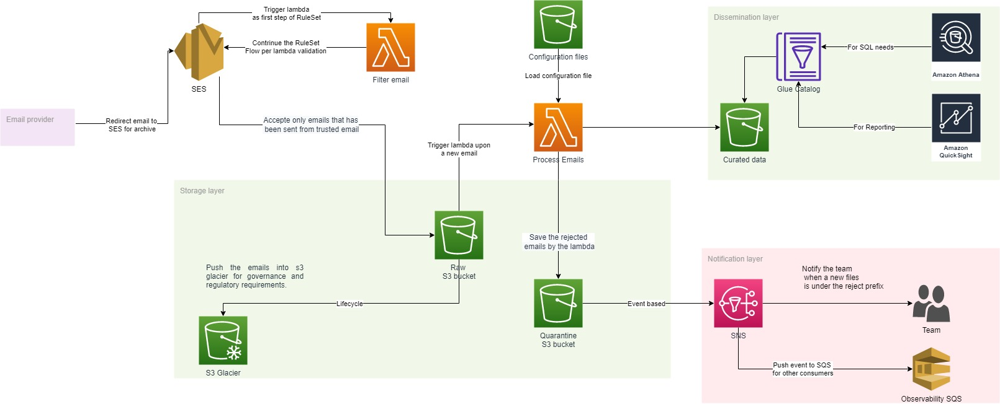
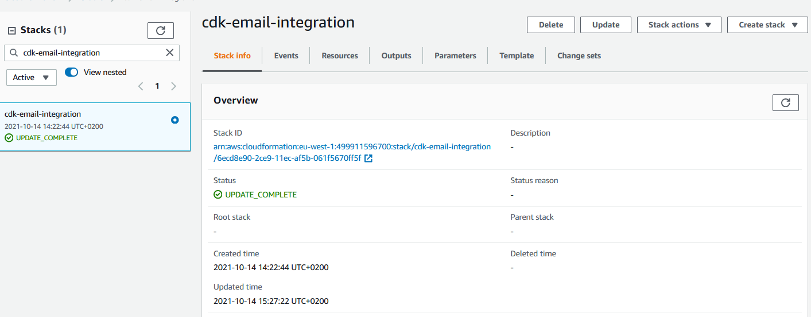
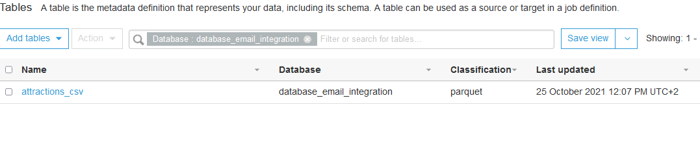
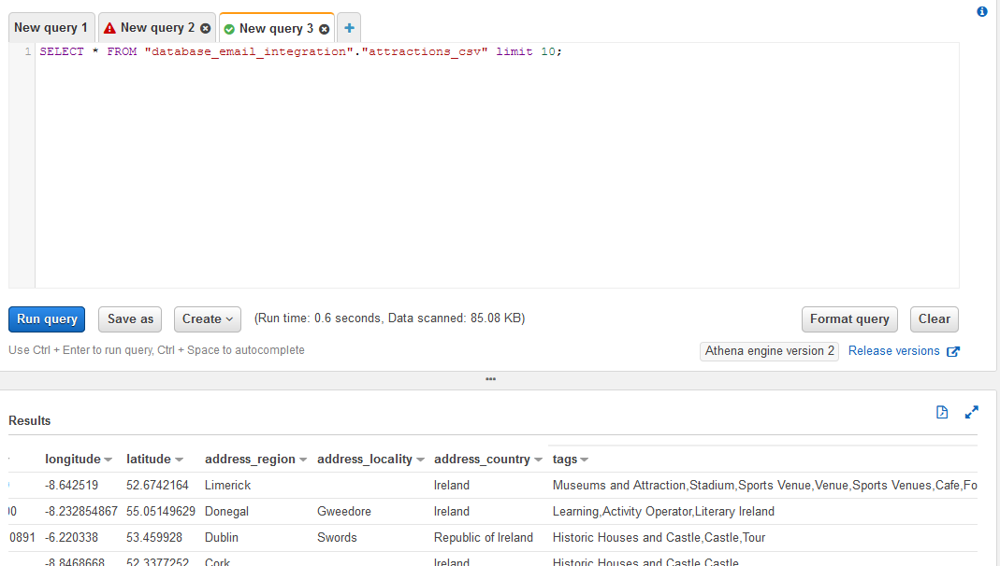
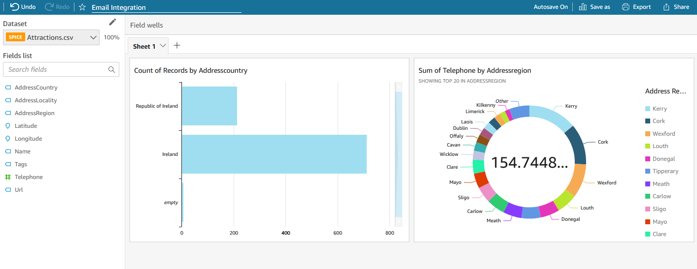

## Build and automate your email spreadsheets ingestion using AWS CDK

This repository will help you deploy a fully serverless architecture that ingest spreadsheets automatically from emails, runs validation rules on the data, and make them available to query in Amazon Athena and visualization in Amazon Quicksight.

The solution uses:
* AWS CDK for Infrastructure as Code, 
* Amazon S3 lifecycle policy for cost optimization,
* Amazon SNS for observability. 
 
We use AWS Data Wrangler library in python to write the data sheets into Amazon S3 and use the inference schema from Pandas to create the Amazon Glue table on the fly and have a queryable data without the use of crawlers. 

For email ingestion we use Amazon SES as the inbound service for the emails. Amazon SES uses “Rule sets” to trigger as first step a Lambda function that will filter the emails on the sender email and accept only the emails from verified senders. Once accepted, the email is being pushed into Amazon S3, that triggers a Lambda function for processing the emails and push them into the appropriate Amazon S3 bucket. 

The data is pushed into two different bucket prefixes:
* Curated: store the attachments being processed and transformed into parquet for analytics workload.
* Quarantine: store the attachments as well as the source email that has failed the validation checks in the lambda function. Any objects in that bucket prefix triggers an event that notifies the team through Amazon SNS.



## Deployment Steps

Pre-requisites:

* An AWS profile with permissions to create the needed resources (see diagram below)
* AWS CLI, authenticated and configured
* Python 3.6+
* AWS CDK v2.10.0
* Git
* Bootstrapped AWS Account for AWS CDK - https://docs.aws.amazon.com/cdk/latest/guide/bootstrapping.html

Step 1: Using your device’s command line, check out this Git repository to a local directory on your device

`git clone https://github.com/aws-samples/aws-cdk-ingest-email-spreadsheet`

Step 2: Change directory to the new directory that was created during the previous step

`cd aws-cdk-ingest-email-spreadsheet/`

Step 3: Create a virtual environment

`macOS/Linux: python3 -m venv .cdk-venv` <br>
`Windows: python -m venv .cdk-venv`

Step 4: Activate the virtual environment after the init process completes, and the virtual environment is created

`macOS/Linux: source .cdk-venv/bin/activate` <br>
`Windows: .cdk-venv\Scripts\activate.bat`

Step 5: Install the required dependencies

`pip3 install -r requirements/stacks.txt`

Step 6: Synthesize the templates. AWS CDK apps use code to define the infrastructure, and when ran, they produce, or
“synthesize” an AWS CloudFormation template for each stack defined in the application

`cdk synthesize`

Step 7: Deploy the solution

`cdk deploy cdk-email-integration`

Review the resources that AWS CDK creates for you in your AWS account and choose yes to deploy the stack.


## How to use

This architecture relies on a dynamic configuration for the emails acceptance criteria.

We are using cdk.json that holds the details about the context of our application and to tell the CDK CLI how to execute our CDK code.

Update this part in cdk.json to customize it for your solution:

````json
   "IngestEmailConfiguration": {
       "GLUE_DATABASE_NAME": "database_email_Ingestion",
       "S3_PREFIX_RAW": "tooling",
       "S3_PREFIX_QUARANTINE": "quarantine_email", 
       "S3_PREFIX_CURATED": "curated_emails",
       "SES_RECIPIENT": "email_you_own@server.com",
       "ACCEPTED_SENDERS": "trusted_emails@server.com,emailtest2@email.com"
     }
````
*   **GLUE_DATABASE_NAME**: The glue database name that the AWS CDK will create;
*   **S3_PREFIX_RAW**:  the S3 prefix that will store your RAW emails;
*   **S3_PREFIX_QUARANTINE**: the S3 prefix that will store the emails that was not processed successfully by the processing lambda function (either a wrong data format or a wrong extension - not tabular data);
*   **S3_PREFIX_CURATED**: the S3 prefix that will store your tabular data extracted from the attachment of the emails;
*   **SES_RECIPIENT**: the email that will be on the SES for receiving the emails and trigger the flow - it needs to be on a domain that you can validate. More details: https://docs.aws.amazon.com/ses/latest/DeveloperGuide/verify-email-addresses.html
*   **ACCEPTED_SENDERS**: to avoid SPAM, SES will use list of emails (delimited with comma) to prune or accept the emails to be processed.
*   **OPS_TEAM_EMAIL**: the email of the OPS team that will receive a notification in case an email failed to be processed.

In order to avoid deploying the infrastructure all over again to change the configuration above, you can update the file in config/email.json that will be read by the lambda dynamically.


## How to test

Wait for the stack to be deployed completely on you AWS account.



### Activate SES rule set

By default, the SES rule set created will not be active, follow these steps to activate it:
1. Move to the AWS SES service
2. Choose "Rule Sets" under "Email Receiving"
3. Select the rule set "RuleSetSinkToS3"
4. Click on "Set as Active Rule Set"


### Ready to test
Send a new email using your favorite email client:

* **Sender**: Use the email that is trusted in **ACCEPTED_SENDERS**
* **To**: Use the email that has been set for SES IN **SES_RECIPIENT**
* **Attachment**:  a valid CSV file.

### Validation
Move to your Glue Database "**database_email_integration**" to see your first table created with the name of the CSV attachment.



Query data using AWS Athena



Visualize data using AWS Quicksight



## Clean up

In order to destroy the stack created, first deactivate the rule set, then follow this step to remove the resources that were deployed in this post.
````
cdk destroy cdk-email-integration
````
When asked to confirm the deletion of the CDK stack, select “y”.

Please note that the main S3 bucket is not deleted. This is the expected behavior, since we do not want to delete the stored emails data when deleting the stack.

## Security

See [CONTRIBUTING](CONTRIBUTING.md#security-issue-notifications) for more information.

## License

This library is licensed under the MIT-0 License. See the LICENSE file.

